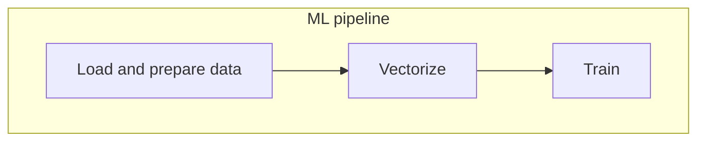

- # **MLOps:** 


<br/>

-  # 🎯 Steps in a Machine Learning Project:
1. ### **Design:** In the design step, you are considering the problem at hand—to decide whether or not you'll need a machine learning algorithm to achieve the objective.
2. ### **Train**: Once you decide on using a machine learning algorithm, you train the model and optimize its performance on the validation dataset.
3. ### **Operate**: The operate state captures the performance of the model after it's deployed.

<br />

- # 💻 Environment preparation:
- ### [Azure](https://github.com/ahmadSoliman94/mlops/tree/main/1-intro/Azure)

- # Download and predict Data
### After the Prepartions i can download any data set using:
```wegt (dataset-link)```


<br />

# Course overview


When data scientists experiment with Jupyter Notebooks for creating models, they often don't follow best practices and are often unstructured due to the nature of experimentation: cells are re-run with slightly different values and previous results may be lost, or the cell execution order may be inconsistent, for example.

***Module 2*** covers ***experiment tracking***: by using tools such as [MLflow](
   


   
) we will create ***experiment trackers*** (such as the history of cells that we've rerun multiple times) and ***model registries*** (for storing the models we've created during the experiments), instead of relying on our memory or janky setups such as external spreadsheets or convoluted naming schemes for our files.

***Module 3*** covers ***orchestration and ML pipelines***: by using tools such as [Prefect](https://www.prefect.io/) and [Kubeflow](https://www.kubeflow.org/) we can break down our notebooks into separate identifyable steps and connect them in order to create a ***ML pipeline*** which we can parametrize with the data and models we want and easily execute.



***Module 4*** covers ***serving the models***: we will learn how to deploy models in different ways.

***Module 5*** covers ***model monitoring***: we will see how to check whether our model is performing fine or not and how to generate alers to warn us of performance drops and failures, and even automate retraining and redeploying models without human input.

***Module 6*** covers ***best practices***, such as how to properly maintain and package code, how to deploy successfully, etc.

***Module 7*** covers ***processes***: we will see how to properly communicate between all the stakeholders of a ML project (scientists, engineers, etc) and how to work together.


## 📑MLOps Maturity Model

Reference: [MLOps Maturity Model: Microsoft Docs](https://docs.microsoft.com/en-us/azure/architecture/example-scenario/mlops/mlops-maturity-model)

|Level|Description|Overview|When Should You Use?|
|---|---|---|---|
|0️⃣|No Automation 😢|<ul><li>All code in Jupyter Notebook</li><li>No pipeline, experiment tracking, and metadata</li> </ul>|<ul><li>Academic projects</li><li>Proof of Concept is the end goal, not production-ready models</li></ul>|
|1️⃣|Yes! DevOps😀, No MLOps|<ul><li>Best engineering practices followed</li><li>Automated releases</li><li>Unit \& Integration Tests</li><li>CI/CD pipelines</li><li>No experiment tracking and reproducibility</li><li>Good from engineering standpoint, models are not ML-aware yet!</li></ul>|<ul><li>Moving from proof of concept to production</li><li>When you need some automation</li><ul>|
|2️⃣|Automated Training 🛠|<ul><li>Training pipelines</li><li>Experiment tracking</li><li>Model registry (track of currently deployed models)</li><li>Data scientists work in tandem with the engineering team</li><li>Low friction deployment</li></ul>|<ul><li>When you have increasing number of use cases</li><li>Three or more use cases, you should definitely consider automating!</li><ul>|
|3️⃣|Automated Deployment 💬|<ul><li>Model deployment simplified!</li><li>Prep data >> Train model >> Deploy model</li><li>A/B testing</li><li>Model X: v1, v2 >> v2 is deployed; how to ensure v2 performs better?</li><li>Model monitoring</li></ul>|<ul><li>Multiple use cases</li><li>More mature + important use cases</li><ul>|
|4️⃣|Full MLOps Automation ⚙ |<ul><li>Automated training</li><li>Automated retraining</li><li>Automated deployment</li></ul>|<ul><li>Check if level 2, 3 won't suffice</li><li>Should model retraining and deployment be automated as well?</li><li>Super important to take a pragmatic decision! Do you really need level 4?😄</li><ul>|
