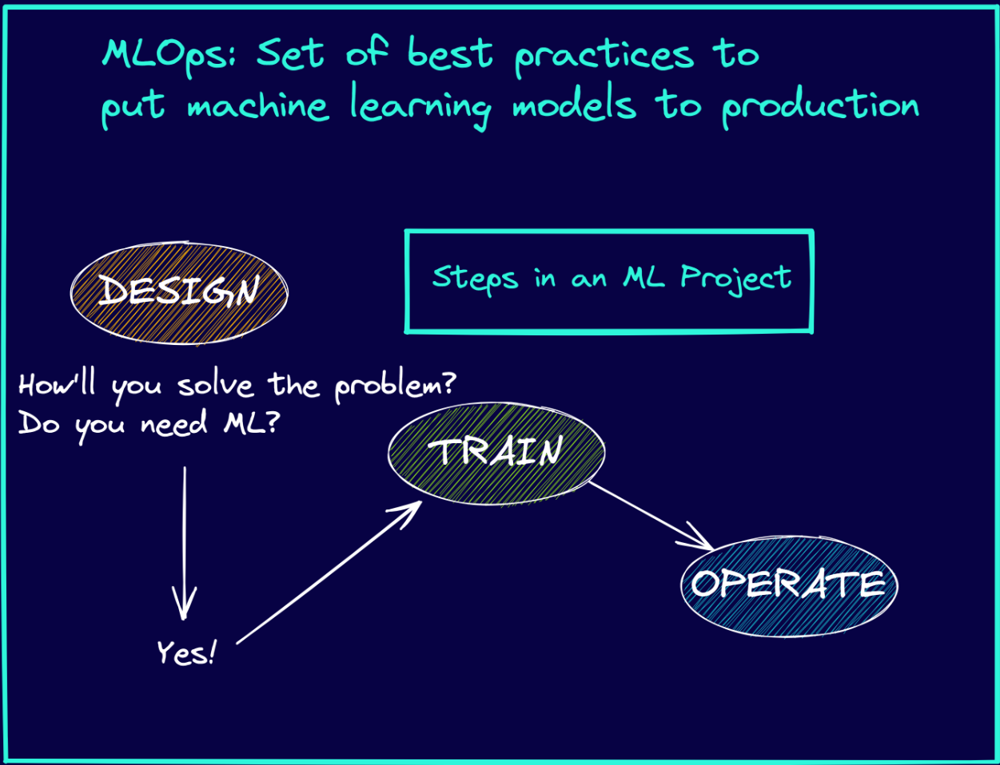
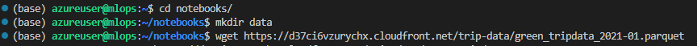
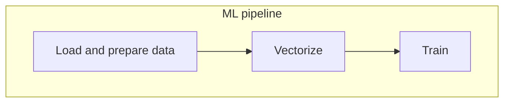

- # **MLOps:** 


<br/>

-  # 🎯 Steps in a Machine Learning Project:
1. ### **Design:** In the design step, you are considering the problem at hand—to decide whether or not you'll need a machine learning algorithm to achieve the objective.
2. ### **Train**: Once you decide on using a machine learning algorithm, you train the model and optimize its performance on the validation dataset.
3. ### **Operate**: The operate state captures the performance of the model after it's deployed.

<br />

- # 💻 Environment preparation:
- ### [Azure](https://github.com/ahmadSoliman94/mlops/tree/main/1-intro/Azure)

- # Download and predict Data
### After the Prepartions i can download any data set using:
```wegt (dataset-link)```



<br />

# Course overview

_[Video source](https://www.youtube.com/watch?v=teP9KWkP6SM&list=PL3MmuxUbc_hIUISrluw_A7wDSmfOhErJK&index=6)_

When data scientists experiment with Jupyter Notebooks for creating models, they often don't follow best practices and are often unstructured due to the nature of experimentation: cells are re-run with slightly different values and previous results may be lost, or the cell execution order may be inconsistent, for example.

***Module 2*** covers ***experiment tracking***: by using tools such as [MLflow](
   


   
) we will create ***experiment trackers*** (such as the history of cells that we've rerun multiple times) and ***model registries*** (for storing the models we've created during the experiments), instead of relying on our memory or janky setups such as external spreadsheets or convoluted naming schemes for our files.

***Module 3*** covers ***orchestration and ML pipelines***: by using tools such as [Prefect](https://www.prefect.io/) and [Kubeflow](https://www.kubeflow.org/) we can break down our notebooks into separate identifyable steps and connect them in order to create a ***ML pipeline*** which we can parametrize with the data and models we want and easily execute.



***Module 4*** covers ***serving the models***: we will learn how to deploy models in different ways.

***Module 5*** covers ***model monitoring***: we will see how to check whether our model is performing fine or not and how to generate alers to warn us of performance drops and failures, and even automate retraining and redeploying models without human input.

***Module 6*** covers ***best practices***, such as how to properly maintain and package code, how to deploy successfully, etc.

***Module 7*** covers ***processes***: we will see how to properly communicate between all the stakeholders of a ML project (scientists, engineers, etc) and how to work together.

_[Back to the top](#)_

# Maturity model

_[Video source](https://www.youtube.com/watch?v=XwTH8BDGzYk&list=PL3MmuxUbc_hIUISrluw_A7wDSmfOhErJK&index=8)_

The different levels of MLOps maturity that we will discuss during the course are based on the levels listed [in this Microsoft Azure article](https://docs.microsoft.com/en-us/azure/architecture/example-scenario/mlops/mlops-maturity-model). These levels are:

0. ***No MLOps***
   *  No automation whatsoever, sloppy Jupyter Notebooks.
   *  Good enough for Proof Of Concept projects.
1. ***DevOps but no MLOps***
   * Releases are automated, unit tests and integration tests exist, CI/CD, operational metrics.
   * But all of these are not ML aware, so no experiment tracking, no reproducibility and the data scientists are still separated from the engineers.
   * Good for POC and production for some projects.
2. ***Automated training***
   * Training pipeline, experiment tracking, model registry. Low friction deployment.
   * DS work with engineers in the same team.
3. ***Automated deployment***
   * Easy to deploy model, very low friction.
     * ```mermaid
        flowchart LR
              direction LR
              A[Data\n prep]
              B[Train\n model]
              C[Deploy\n model]
              A --> B --> C
        ```
   * A/B tests (not covered in this course).
   * Model monitoring.
     * The Microsoft article actually places this feature in maturity level 4 but for our purposes it makes more sense to have it here.
4. ***Full MLOps automation***
   * Automated training and deployment. All of the above combined.

Be aware that not every project or even every part of a project needs to have the highest maturity level possible because it could exceed the project's resource budget. **Pragmatism is key**.
