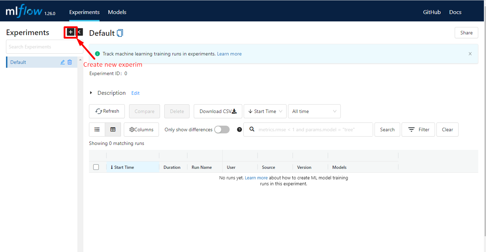
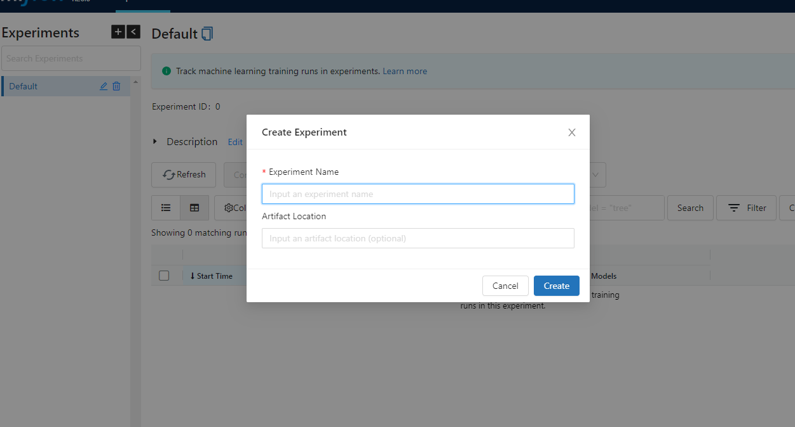
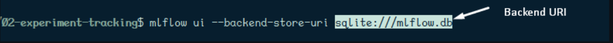
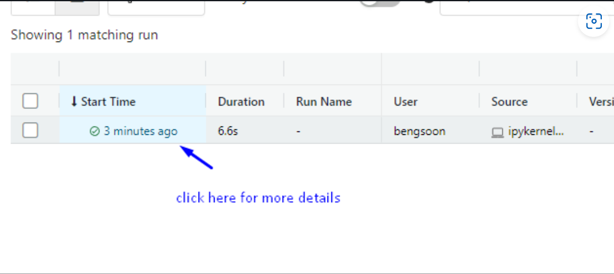
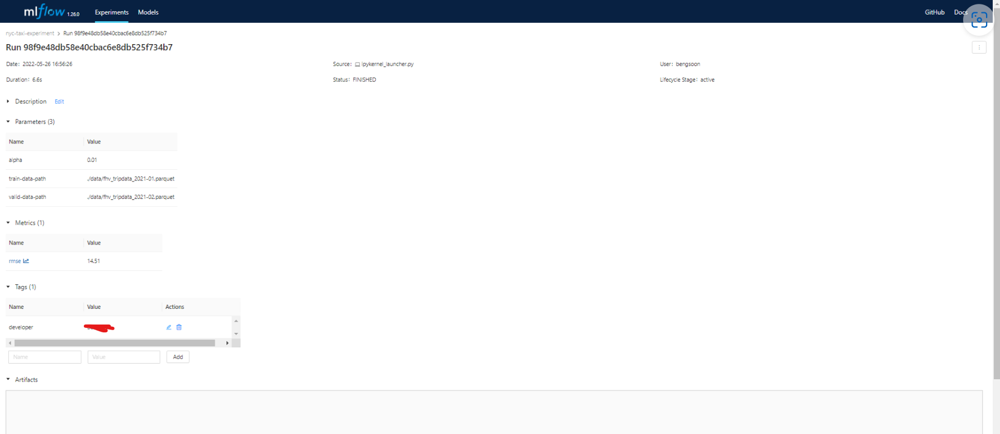

# MLflow, ML experiments and model registry
- ### __ML experiment__: the process of building an ML model; The whole process in which a Data Scientist creates and optimizes a model.
- ### **Experiment run**: each trial in an ML experiment; Each run is within an ML experiment.
- ### **Run artifact**: any file associated with an ML run: Examples include the model itself, package versions...etc; Each Artifact is tied to an Experiment.
- ### **Experiment metadata**: metadata tied to each experiment.

<br />

# - Experiment Tracking: 

- ### The process of keeping track of all the relevant information from an ML experiment, which includes:
    - Source code.
    - Environment.
    - Data (different versions).
    - Model (different architectures).
    - Hyperparameters.
    - Metrics.

<br />

- ### Why is Experiment Tracking so important?
    1. Reproducibility
    2. Organization
    3. Optimization

>> __NOTE:__ Tracking experiments in spreadsheets is not enough: Error Prone, No standard format and Visibility & Collaboration.

<br />

# MLflow:
- ### "An Open source platform for the machine learning lifecycle"

- ### It's a Python package with four main modules:
    - Tracking
    - Models
    - Model registry
    - Projects.

<br />

## 1. Tracking:
- ### The MLFlow Tracking module allows you to organize your experiments into runs and to keep track of:

    1. Parameters.
    2. Metrics.
    3. Metadata.
    4. Artifacts.
    5. Models.

<br />

## 2. Models:
- ### It is a directory where the model is saved along with a few related files denoting its properties, associated information and environment dependencies. Generally a model is served by a variety of downstream tools for serving in real time through REST API or in batch mode. And, the format or flavour of the saved model is decided based on which downstream tool is going to use for model serving. For example mlflow Sklearn library allows loading the model back as a scikit-learn pipeline object while mlflow sagemaker tool wants the model in python_function format. mlflow provides a powerful option for defining required flavours in MLmodel file.

- ### A typical model directory contains the following files:
    - MLmodel - a YAML file describing model flavours, time created, run_id if the model was created in experiment tracking, signature denoting input and output details, input example, version of databricks runtime (if used) and mlflow version.
    - model.pkl - saved model pickle file.
    - conda.yaml - environment specifications for conda environment manager.
    - python_env.yaml - environment specification for virtualenv environment manager.
    - requirements.txt - list of pip installed libraries for dependencies.

<br />

## 3. Model Registry:
- ### Enterprises conduct a lot of experiments and move the selected models to production. Having said that a lot of models are created and saved in mlflow Models. Some of them are for new requirements and rest as updated models for same requirements. We needed a versioning and stage transitioning system for the models, that is fulfilled by mlflow Model Registry.

- ### Model Registry serves as a collaborative hub where teams share models and work together from experimentation to testing and production. It provides a set of APIs as well as a UI to manage the entire life cycle of an mlflow model.

### - Model Registry concepts to manage life cycle of mlflow model:
- Model - An mlflow model logged with one of the flavours mlflow.<model_flavour>.log_model().
- Registered model - An mlflow model registered on Model Registry. It has a unique name, contains versions, transitional stages, model lineage and other associated metadata.
- Model Version - Version of the registered model.
- Model Stage - Each distinct model version can be associated with one stage at a time. Stages supported are Staging, Production and Archived.
- Annotations and descriptions - Add useful information such as descriptions, data used, methodology etc. to the registered model.


<br />

## 4. Projects
- ### It is a directory or a Git repo containing code files following a convention so that users or tools can run the project using its entry point(s). If a project contains multiple algorithms that can be run separately, in that multiple entry points are mentioned in MLProject file.

- ### Properties of a project:
    - Name - Name of the project.
    + Entry Points - Typically a .py or .sh file to run the entire project or some specific functionality, say an algorithm. List of entry points are mentioned in MLProject file
    - Environment - Specifications such as library dependencies for the software environment for the code to run. Supported environments - conda environments, virtualenv environments, docker environments.

<br />

# MLflow

- ### To install MLflow:

```bash
pip install mlflow
```

- ### MLflow comes with a cli:

```
$ mlflow
```
```
Usage: mlflow [OPTIONS] COMMAND [ARGS]...


Options:
  --version  Show the version and exit.
  --help     Show this message and exit.

Commands:
  artifacts    Upload, list, and download artifacts from an MLflow...
  azureml      Serve models on Azure ML.
  db           Commands for managing an MLflow tracking database.
  deployments  Deploy MLflow models to custom targets.
  experiments  Manage experiments.
  gc           Permanently delete runs in the `deleted` lifecycle stage.
  models       Deploy MLflow models locally.
  run          Run an MLflow project from the given URI.
  runs         Manage runs.
  sagemaker    Serve models on SageMaker.
  server       Run the MLflow tracking server.
  ui           Launch the MLflow tracking UI for local viewing of run...
```

- ### Launching MLflow ui will launch a gunicorn server:
```bash
$ mlflow ui
[2022-05-24 11:47:20 +****] [14391] [INFO] Starting gunicorn 20.1.0
[2022-05-24 11:47:20 +****] [14391] [INFO] Listening at: http://127.0.0.1:5000 (14391)
[2022-05-24 11:47:20 +****] [14391] [INFO] Using worker: sync
[2022-05-24 11:47:20 +****] [14392] [INFO] Booting worker with pid: 14392
```

<br />

- ### We then go to the browser to view the page http://127.0.0.1:5000


<br />

- ### MLflow UI: Create New Experiment


<br />


- ### Experiment Name - Name of the Experiment
- ### Artifact Location - Location where you'd save the files for the experiment runs
    - ### Could be pickle file, local folder etc.
    - ### Could even be an S3 Bucket.

<br />

# Getting Started with MLflow:
- ### Prepare local env.
- ### Install MLflow client and configure a backend.
- ### Add MLflow to the existing notebook, log the predictions and view it on MLflow UI.

<br />

## Create the environment:
### First, we should create a conda environment (we'll name it `exp-tracking-env`) so that we do not disrupt our system's installation:

```bash
conda create -n exp-tracking-env python=3.9
```

### Then, we will activate the environment:

```bash
conda activate exp-tracking-env
````
<br />

## Install the required packages:
### To install these packages, we will point pip to our requirements.txt within our newly-created conda environment:

```
(exp-tracking-env) $ pip install -r requirements.txt
```

<br />

## Starting MLflow with sqlite backend:
- ### To start MLflow UI with the backend connected to an sqlite database, we have to use the following command (take note of the triple front-slashes):
```
(exp-tracking-env) $ mlflow ui --backend-store-uri sqlite:///mlflow.db
```
<br />

- ### to stop mlflow ui server: 
```
fuser -k 5000/tcp
```


## Add MLflow to Existing Notebook:
- ### First we copy the python notebooke (`duration-prediction.ipynb`) and the `data` folder to the folder (`2- experiment-tracking`). 

- ### We also need to create a `models` folder, where we will save all the model artifacts, otherwise we will see an error.

<br />

## Python Notebook with MLflow:
### - Let's open up our Python notebook using juypter lab.
- ### First we have to ensure that the required Python libraries can be imported and that the Python version is the same as when we previously trained the model.
### - Then we need to import the MLflow library:

```python
import mlflow
```
- ### We also need to set tracking URI to point the library to the SQLite backend database for MLFlow in the Note book. The URI is the one parameter in the mlflow ui cli:



```python
mlflow.set_tracking_uri("sqlite:///mlflow.db")
```
- ### we need to create new experiments in mlflow UI page with name (nyc-taxi-experiment).

- ### We also need to set the experiment. If the experiment does not exist, MLflow will automatically create the experiment for us.

```python
mlflow.set_experiment("nyc_taxi_experiment")
```
```
2022/05/25 11:20:29 INFO mlflow.tracking.fluent: Experiment with name 'nyc-taxi-experiment' does not exist. Creating a new experiment.
<Experiment: artifact_location='./mlruns/2', experiment_id='2', lifecycle_stage='active', name='nyc-taxi-experiment', tags={}
```

- ### To start tracking our runs, need to append a with `mlflow.start_run()` on our training cell.

```python
# start logging with mlflow
with mlflow.start_run():
    ...
```
- ### We start logging information about this tag called "developer"
```python
    # set tag for mlflow
    mlflow.set_tag("developer", "Ahmad")
```
- ### We logging also information about dataset. In our case we are going to save the source of the data for both training and validation:
```python
    # set data path param
    mlflow.log_param("train-data-path", "./data/fhv_tripdata_2021-01.parquet")
    mlflow.log_param("valid-data-path", "./data/fhv_tripdata_2021-02.parquet") 
```

- ### Let's say we are going to train a `Lasso()` model, and for this run we will set our hyperparameter `alpha = 0.01`. We should log this as a parameter in mlflow:
```python
    # set hyper parameter for Lasso
    alpha = 0.001
    mlflow.log_param("alpha", alpha)
    lr = Lasso(alpha = alpha)
```
- ### Once we have trained the model, we will calculate its `rmse` score against our validation set. We should also log this as a parameter:
```python
    # get RMSE and record on mlflow
    rmse = round(mean_squared_error(y_val, y_pred, squared=False),2)
    print("RMSE for training data:", rmse)
    mlflow.log_metric("rmse", rmse)
```

### - Here is the whole code block for training the model, validating its performance and recording the run information on mlflow:

```python
# start logging with mlflow
with mlflow.start_run():
    # set tag for mlflow
    mlflow.set_tag("developer", "Bengsoon")

    # set data path param
    mlflow.log_param("train-data-path", "./data/fhv_tripdata_2021-01.parquet")
    mlflow.log_param("valid-data-path", "./data/fhv_tripdata_2021-02.parquet")

    # set hyper parameter for Lasso
    alpha = 0.01
    mlflow.log_param("alpha", alpha)
    lr = Lasso(alpha = alpha)
    
    # train the model
    lr.fit(X_train, y_train)

    # get the y_pred from X_train
    y_pred = lr.predict(X_val)

    # get RMSE and record on mlflow
    rmse = round(mean_squared_error(y_val, y_pred, squared=False),2)
    print("RMSE for training data:", rmse)
    mlflow.log_metric("rmse", rmse)
```
- ### To view the run details, we can click on the Start Time value:


