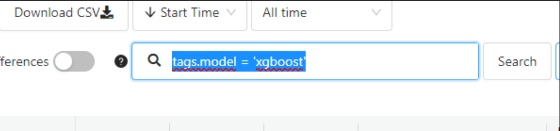
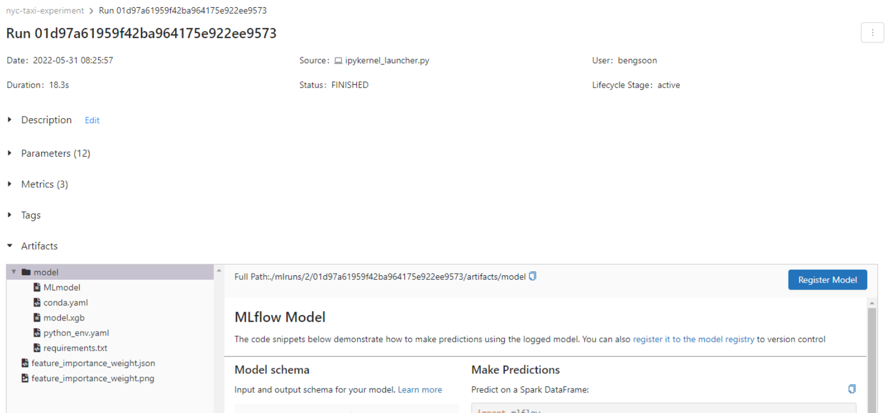
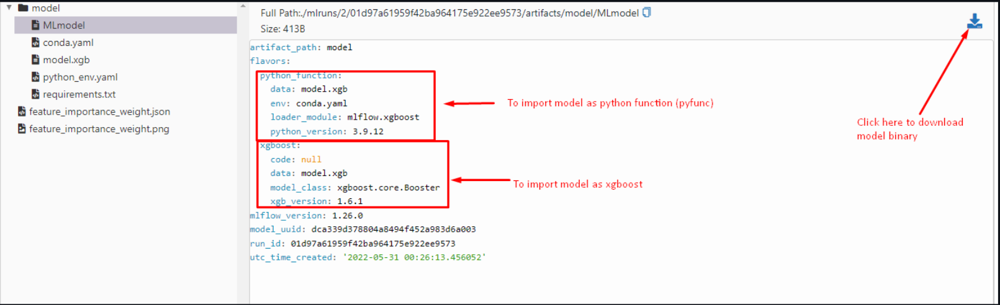
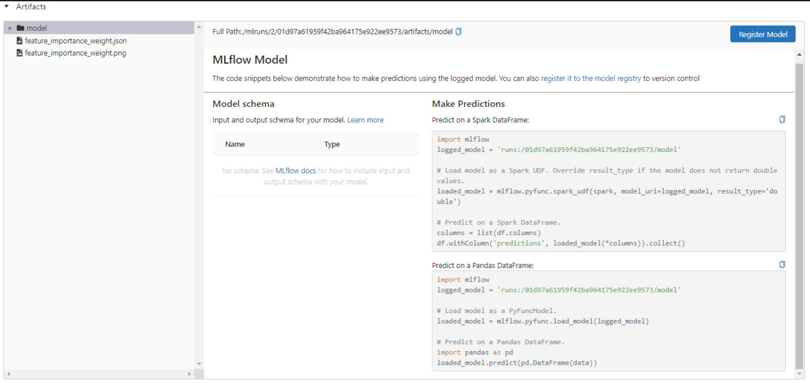
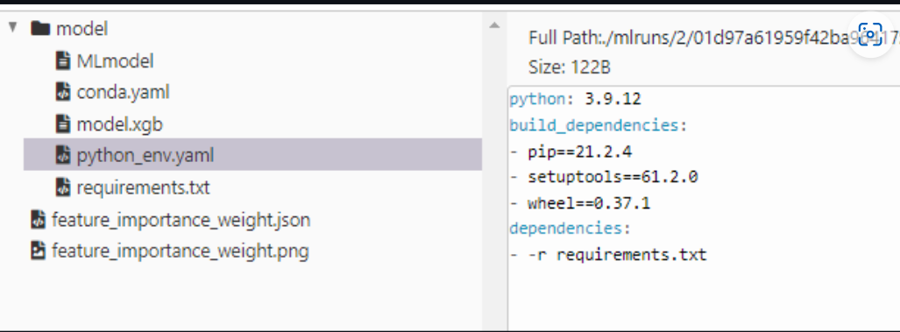

# MLflow, ML experiments and model registry
- ### __ML experiment__: the process of building an ML model; The whole process in which a Data Scientist creates and optimizes a model.
- ### **Experiment run**: each trial in an ML experiment; Each run is within an ML experiment.
- ### **Run artifact**: any file associated with an ML run: Examples include the model itself, package versions...etc; Each Artifact is tied to an Experiment.
- ### **Experiment metadata**: metadata tied to each experiment.

<br />

# - Experiment Tracking: 

- ### The process of keeping track of all the relevant information from an ML experiment, which includes:
    - Source code.
    - Environment.
    - Data (different versions).
    - Model (different architectures).
    - Hyperparameters.
    - Metrics.

<br />

- ### Why is Experiment Tracking so important?
    1. Reproducibility
    2. Organization
    3. Optimization

>> __NOTE:__ Tracking experiments in spreadsheets is not enough: Error Prone, No standard format and Visibility & Collaboration.

<br />

# MLflow:
- ### "An Open source platform for the machine learning lifecycle"

- ### It's a Python package with four main modules:
    - Tracking
    - Models
    - Model registry
    - Projects.

<br />

## 1. Tracking:
- ### The MLFlow Tracking module allows you to organize your experiments into runs and to keep track of:

    1. Parameters.
    2. Metrics.
    3. Metadata.
    4. Artifacts.
    5. Models.

<br />

## 2. Models:
- ### It is a directory where the model is saved along with a few related files denoting its properties, associated information and environment dependencies. Generally a model is served by a variety of downstream tools for serving in real time through REST API or in batch mode. And, the format or flavour of the saved model is decided based on which downstream tool is going to use for model serving. For example mlflow Sklearn library allows loading the model back as a scikit-learn pipeline object while mlflow sagemaker tool wants the model in python_function format. mlflow provides a powerful option for defining required flavours in MLmodel file.

- ### A typical model directory contains the following files:
    - MLmodel - a YAML file describing model flavours, time created, run_id if the model was created in experiment tracking, signature denoting input and output details, input example, version of databricks runtime (if used) and mlflow version.
    - model.pkl - saved model pickle file.
    - conda.yaml - environment specifications for conda environment manager.
    - python_env.yaml - environment specification for virtualenv environment manager.
    - requirements.txt - list of pip installed libraries for dependencies.

<br />

## 3. Model Registry:
- ### Enterprises conduct a lot of experiments and move the selected models to production. Having said that a lot of models are created and saved in mlflow Models. Some of them are for new requirements and rest as updated models for same requirements. We needed a versioning and stage transitioning system for the models, that is fulfilled by mlflow Model Registry.

- ### Model Registry serves as a collaborative hub where teams share models and work together from experimentation to testing and production. It provides a set of APIs as well as a UI to manage the entire life cycle of an mlflow model.

### - Model Registry concepts to manage life cycle of mlflow model:
- Model - An mlflow model logged with one of the flavours mlflow.<model_flavour>.log_model().
- Registered model - An mlflow model registered on Model Registry. It has a unique name, contains versions, transitional stages, model lineage and other associated metadata.
- Model Version - Version of the registered model.
- Model Stage - Each distinct model version can be associated with one stage at a time. Stages supported are Staging, Production and Archived.
- Annotations and descriptions - Add useful information such as descriptions, data used, methodology etc. to the registered model.


<br />

## 4. Projects
- ### It is a directory or a Git repo containing code files following a convention so that users or tools can run the project using its entry point(s). If a project contains multiple algorithms that can be run separately, in that multiple entry points are mentioned in MLProject file.

- ### Properties of a project:
    - Name - Name of the project.
    + Entry Points - Typically a .py or .sh file to run the entire project or some specific functionality, say an algorithm. List of entry points are mentioned in MLProject file
    - Environment - Specifications such as library dependencies for the software environment for the code to run. Supported environments - conda environments, virtualenv environments, docker environments.

<br />

# MLflow

- ### To install MLflow:

```bash
pip install mlflow
```

- ### MLflow comes with a cli:

```
$ mlflow
```
```
Usage: mlflow [OPTIONS] COMMAND [ARGS]...


Options:
  --version  Show the version and exit.
  --help     Show this message and exit.

Commands:
  artifacts    Upload, list, and download artifacts from an MLflow...
  azureml      Serve models on Azure ML.
  db           Commands for managing an MLflow tracking database.
  deployments  Deploy MLflow models to custom targets.
  experiments  Manage experiments.
  gc           Permanently delete runs in the `deleted` lifecycle stage.
  models       Deploy MLflow models locally.
  run          Run an MLflow project from the given URI.
  runs         Manage runs.
  sagemaker    Serve models on SageMaker.
  server       Run the MLflow tracking server.
  ui           Launch the MLflow tracking UI for local viewing of run...
```

- ### Launching MLflow ui will launch a gunicorn server:
```bash
$ mlflow ui
[2022-05-24 11:47:20 +****] [14391] [INFO] Starting gunicorn 20.1.0
[2022-05-24 11:47:20 +****] [14391] [INFO] Listening at: http://127.0.0.1:5000 (14391)
[2022-05-24 11:47:20 +****] [14391] [INFO] Using worker: sync
[2022-05-24 11:47:20 +****] [14392] [INFO] Booting worker with pid: 14392
```

<br />

- ### We then go to the browser to view the page http://127.0.0.1:5000


<br />

- ### MLflow UI: Create New Experiment


<br />


- ### Experiment Name - Name of the Experiment
- ### Artifact Location - Location where you'd save the files for the experiment runs
    - ### Could be pickle file, local folder etc.
    - ### Could even be an S3 Bucket.

<br />

# Getting Started with MLflow:
- ### Prepare local env.
- ### Install MLflow client and configure a backend.
- ### Add MLflow to the existing notebook, log the predictions and view it on MLflow UI.

<br />

## Create the environment:
### First, we should create a conda environment (we'll name it `exp-tracking-env`) so that we do not disrupt our system's installation:

```bash
conda create -n exp-tracking-env python=3.9
```

### Then, we will activate the environment:

```bash
conda activate exp-tracking-env
````
<br />

## Install the required packages:
### To install these packages, we will point pip to our requirements.txt within our newly-created conda environment:

```
(exp-tracking-env) $ pip install -r requirements.txt
```

<br />

## Starting MLflow with sqlite backend:
- ### To start MLflow UI with the backend connected to an sqlite database, we have to use the following command (take note of the triple front-slashes):
```
(exp-tracking-env) $ mlflow ui --backend-store-uri sqlite:///mlflow.db
```
<br />

- ### to stop mlflow ui server: 
```
fuser -k 5000/tcp
```


## Add MLflow to Existing Notebook:
- ### First we copy the python notebooke (`duration-prediction.ipynb`) and the `data` folder to the folder (`2- experiment-tracking`). 

- ### We also need to create a `models` folder, where we will save all the model artifacts, otherwise we will see an error.

<br />

## Python Notebook with MLflow:
### - Let's open up our Python notebook using juypter lab.
- ### First we have to ensure that the required Python libraries can be imported and that the Python version is the same as when we previously trained the model.
### - Then we need to import the MLflow library:

```python
import mlflow
```
- ### We also need to set tracking URI to point the library to the SQLite backend database for MLFlow in the Note book. The URI is the one parameter in the mlflow ui cli:


```python
mlflow.set_tracking_uri("sqlite:///mlflow.db")
```
- ### we need to create new experiments in mlflow UI page with name (nyc-taxi-experiment).

- ### We also need to set the experiment. If the experiment does not exist, MLflow will automatically create the experiment for us.

```python
mlflow.set_experiment("nyc_taxi_experiment")
```
```
2022/05/25 11:20:29 INFO mlflow.tracking.fluent: Experiment with name 'nyc-taxi-experiment' does not exist. Creating a new experiment.
<Experiment: artifact_location='./mlruns/2', experiment_id='2', lifecycle_stage='active', name='nyc-taxi-experiment', tags={}
```

- ### To start tracking our runs, need to append a with `mlflow.start_run()` on our training cell.

```python
# start logging with mlflow
with mlflow.start_run():
    ...
```
- ### We start logging information about this tag called "developer"
```python
    # set tag for mlflow
    mlflow.set_tag("developer", "Ahmad")
```
- ### We logging also information about dataset. In our case we are going to save the source of the data for both training and validation:
```python
    # set data path param
    mlflow.log_param("train-data-path", "./data/fhv_tripdata_2021-01.parquet")
    mlflow.log_param("valid-data-path", "./data/fhv_tripdata_2021-02.parquet") 
```

- ### Let's say we are going to train a `Lasso()` model, and for this run we will set our hyperparameter `alpha = 0.01`. We should log this as a parameter in mlflow:
```python
    # set hyper parameter for Lasso
    alpha = 0.001
    mlflow.log_param("alpha", alpha)
    lr = Lasso(alpha = alpha)
```
- ### Once we have trained the model, we will calculate its `rmse` score against our validation set. We should also log this as a parameter:
```python
    # get RMSE and record on mlflow
    rmse = round(mean_squared_error(y_val, y_pred, squared=False),2)
    print("RMSE for training data:", rmse)
    mlflow.log_metric("rmse", rmse)
```

### - Here is the whole code block for training the model, validating its performance and recording the run information on mlflow:

```python
# start logging with mlflow
with mlflow.start_run():
    # set tag for mlflow
    mlflow.set_tag("developer", "Bengsoon")

    # set data path param
    mlflow.log_param("train-data-path", "./data/fhv_tripdata_2021-01.parquet")
    mlflow.log_param("valid-data-path", "./data/fhv_tripdata_2021-02.parquet")

    # set hyper parameter for Lasso
    alpha = 0.01
    mlflow.log_param("alpha", alpha)
    lr = Lasso(alpha = alpha)
    
    # train the model
    lr.fit(X_train, y_train)

    # get the y_pred from X_train
    y_pred = lr.predict(X_val)

    # get RMSE and record on mlflow
    rmse = round(mean_squared_error(y_val, y_pred, squared=False),2)
    print("RMSE for training data:", rmse)
    mlflow.log_metric("rmse", rmse)
```
- ### To view the run details, we can click on the Start Time value:


<br />

# Experiment tracking with MLflow:
## We are going to try out an xgboost model and optimize the hyperparameter tuning with a package called `hyperopt`.

- ### Hyperparameter Optimization Tuning:

```python
import xgboost as xgb

from hyperopt import fmin, tpe, hp, STATUS_OK, Trials
from hyperopt.pyll import scope

train = xgb.DMatrix(X_train, label=y_train)
valid = xgb.DMatrix(X_val, label=y_val)
```
- `fmin`: tries to minimize objective function.
- `tpe`: algorithm that controls the flow.
- `hp`: hyperparameter space.
- `STATUS_OK`: signal if the optimization is succesful at the end of each run
Trials: will keep track of information from each run.

<br />

- ### We create an objective function that trains the xgboost model with a set of hyperparameters (from hyperopt) and then validated against our validation data. For each set of hyperparameters and the model's corresponding performance score, we record them in mlflow by wrapping it around the function.

```python
def objective(params):
    with mlflow.start_run():
        mlflow.set_tag("model", "xgboost")
        mlflow.log_params(params)
        booster = xgb.train(
            params=params,
            dtrain=train,
            num_boost_round=1000,
            evals=[(valid, 'validation')],
            early_stopping_rounds=50
        )
        y_pred = booster.predict(valid)
        rmse = mean_squared_error(y_val, y_pred, squared=False)
        mlflow.log_metric("rmse", rmse)

    return {'loss': rmse, 'status': STATUS_OK}
```

- ### We then create the search space dictionary for the XGboost hyperparameters. We use `hp` to create different kinds of statistical distributions for our parameters:
```python
search_space = {
    'max_depth': scope.int(hp.quniform('max_depth', 4, 100, 1)),
    'learning_rate': hp.loguniform('learning_rate', -3, 0),
    'reg_alpha': hp.loguniform('reg_alpha', -5, -1),
    'reg_lambda': hp.loguniform('reg_lambda', -6, -1),
    'min_child_weight': hp.loguniform('min_child_weight', -1, 3),
    'objective': 'reg:linear',
    'seed': 42
}
```

- ### Run the `hyperopt` optimization with `fmin` method (minimize loss):
```python
best_result = fmin(
    fn=objective,
    space=search_space,
    algo=tpe.suggest,
    max_evals=50,
    trials=Trials()
)
```

- ### MLflow will track all the runs for the `hyperopt` experiments that we have conducted and we can view the results that we have logged within our objective function.

- ### As we have also set the MLflow tag to "model: xgboost" in our function, we can also filter it in MLflow UI:



<br />

- ### We can also visually compare them in MLflow UI by selecting all the filtered runs and click compare:


<br />

# Model Selection:
- ### There is no hard-and-fast rule to model selection, but here we will consider the following:

    - ### Best metric performance (ie lowest RMSE)
    - ### Lowest training time: sometimes we may have runs with RMSE scores not too far off from each other, but the training time taken is significantly shorter. The simpler the better, if possible.

- ### To do so, we can go back to the Experiments tab in the MLflow UI to select the model that fulfils our criteria:
- ### We know that we will use xgb model, so we will leave the tag filter from before. Then sort the model by ascending RMSE values.Select the model that fulfils our criteria. 

#### -  Selecting the experiment run above, we can look at the hyperparameter values used in this run and rerun the training as our selected model in our notebook.

```python 
# Hyperparameter for run 09923bbad64045ca837a1656254ce756

search_space = {
    'max_depth': 4,
    'learning_rate': 0.14493221791716185,
    'reg_alpha': 0.012153110171030913,
    'reg_lambda': 0.017881159785939696,
    'min_child_weight': 0.674864917045824,
    'objective': 'reg:linear',
    'seed': 42
}
```

<br />

- ### Instead of wrapping our code with with mlflow.start_run(), we can use mlflow autolog for xgboost:

```python
mlflow.xgboost.autolog()

booster = xgb.train(
            params=params,
            dtrain=train,
            num_boost_round=1000,
            evals=[(valid, 'validation')],
            early_stopping_rounds=50
        )
```

- ###  Automatic logging allows you to log metrics, parameters, and models without the need for explicit log statements.

### - There are two ways to use autologging for more details: [Automatic Logging](https://mlflow.org/docs/latest/tracking.html#automatic-logging).



<br />

## The Artifacts:
- ### It also automatically saves the artifacts of the model as well as its corresponding environments / requirements for its usability in production phase. For xgboost, it also saves `feature_importance_weight.json` by default.

- ### Under the MLmodel, it provides us information/metadata regarding the model that was saved. It also shows that the model can be used as a python_function (`pyfunc`) or as an XGBoost model. Here, we can also download the model binary.



<br />

- ### At the top level of the Artifacts, it also provides us information on how we can use the saved models to make predictions (as inference models):



<br />

- ## MLflow Model:

1. ### We first have to make a reference to the saved model with the `runs:/{run_id}/model`, which is a path readable by MLflow.
2. ### We can load the model as PyFuncModel or as XGBoost model (in our case we will load it as XGBoost Model).

```python
 logged_model = 'runs:/a66d6ad15ca940ec92c3a475ca5928b1/model'
```

### - Load model as PyFuncModel:
To load as a PyFuncModel, we can use the method `mlflow.pyfunc.load_model()`

```python
   # Load model as a PyFuncModel.
   loaded_model = mlflow.pyfunc.load_model(logged_model)
   loaded_model
```

- ### Remember that we already have assigned variables for our validation set features?
```python
    # preprocessed DataFrame with DictionaryVectorizer
    X_val = dv.transform(X_val_dict)

    # convert X_val into DMatrix type
    valid = xgb.DMatrix(X_val, label=y_val)
```

- ### As shown above in the MLflow UI, PyFuncModel allows us to use Pandas DataFrame features for its prediction method, unlike XGBoost models which requires us to convert features into `DMatrix` type.

### Passing in `valid` into `loaded_model.predict()` will return an `TypeError: Not supported type for data.<class 'xgboost.core.DMatrix'>`

```python
    loaded_model.predict(valid)

    >> ............
    >> TypeError: Not supported type for data.<class 'xgboost.core.DMatrix'>
```

### - However, the model will be able to make prediction by passing in our preprocessed df X_val:
```python
    loaded_model.predict(X_val)
```

## - Model Environments:
- ### MLflow also provides the Python environment from which the model was trained on. This will help the deployment of the model in the production stage to replicate the same environment as the training stage.

### - MLflow automatically provides 3 types of environment files:
- ### `conda.yaml` for Conda.
- ### `requirements.txt` for pip.
- ### `python_env.yaml` for virtualenv.




